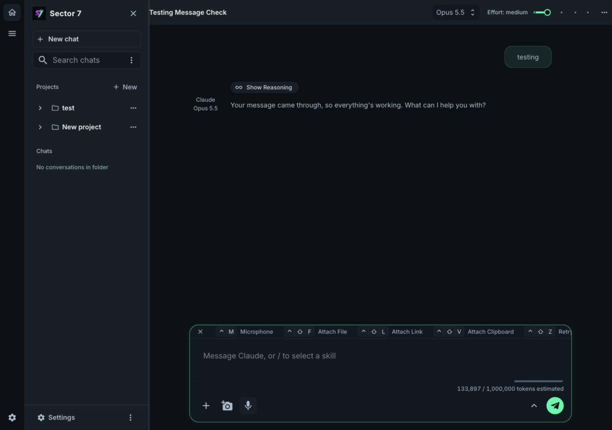

# Sector 7

A local AI workspace for macOS, built from the MIT-licensed [big-AGI](https://github.com/enricoros/big-AGI). Sector 7 combines Claude and GPT-6.1 Sol chat, projects, on-demand file access and terminal tools in a dark, Mako-green interface. The name references Final Fantasy VII; this is an independent personal project.



Version **0.1.0** is a working preview. Run it in a browser with a local server, or build the Electron app for Apple silicon. Both use the same disk-backed workspace and server-configured Bifrost connection. No app account or cloud sync is required. See the [Sector 7 changelog](CHANGELOG.md) for release changes.

## Features

- **Chat models:** Opus 5.5, Sonnet 5.5 and GPT-6.1 Sol, per-chat model selection and five reasoning-effort settings. Medium is the default.
- **Projects:** group chats, share instructions and connect local source folders. Files stay on your Mac and are read when requested.
- **Local tools:** every chat can work with `~/.claude` and `~/.codex` and run terminal commands. Projects add connected folders.
- **Native folder selection:** Electron opens a directory sheet attached to its window. The browser version uses a compiled macOS helper, prepared at startup. Neither picker runs AppleScript.
- **Web tools:** Claude-native search/fetch and Sol Responses `web_search` through Bifrost. Search is on by default. Sol also supports `code_interpreter` through the conversation menu.
- **Conversation tools:** Markdown, code, math, attachments, edit, retry, branch, archive, exports and explicit questions requiring your answer.
- **Local persistence:** chats, projects and owned assets save automatically on disk. Settings provides backups and recovery.
- **Subagents:** delegate a task from chat to a saved child chat, with Sol at medium effort by default. The child returns its result to the parent and inherits project access.
- **Experimental compaction:** Sol uses a 400,000-token working limit and compacts at 360,000 tokens, while retaining the full local transcript.
- **Compact activity:** tool-only rounds show a short activity row; reasoning and detailed tool calls remain available when needed.

## Requirements

| | Browser version | Electron app |
| --- | --- | --- |
| Supported host | macOS | Apple silicon macOS |
| Runtime | Node 22, 24 or 26 and npm | Bundled with the installed app |
| Build tools | Xcode Command Line Tools and Python for native dependencies | Same tools plus Node/npm, only when building |
| AI connection | Bifrost key in environment or macOS Keychain | Bifrost key in environment or macOS Keychain |

Use the same Node major version when installing dependencies and running the browser server. Node 22 is the repository default (`.nvmrc`). The current packaging target is `arm64`; Intel and universal builds are deferred.

## Browser version

Run commands from the repository root:

```sh
npm ci
just up
```

Open [127.0.0.1:3004](http://127.0.0.1:3004/). `just up 3005` chooses another port; `PORT` also overrides the default. Without `just`:

```sh
PORT=3004 npm run dev:local
```

The launcher binds to loopback, loads the Bifrost key, prepares the native folder picker and prevents idle sleep on macOS. The helper compiles once into the ignored `build/native/` directory and is reused until its source or bundle metadata changes. Compilation happens before the server starts, not when Add folder is clicked.

For a production server, stop the existing server before rebuilding its output:

```sh
npm run build
PORT=3004 npm run start:local
```

Use the local launcher for key configuration and folder-picker preparation. A source archive without Git metadata needs `NEXT_PUBLIC_BUILD_HASH=v0.1.0` for the build. Git clones supply their build identity automatically.

## Electron app

Build and install locally. Stop any browser production server using this checkout before building; desktop packaging rebuilds the shared web output:

```sh
npm ci
npm run desktop:setup
npm run desktop:check
npm run desktop:build
npm run desktop:install
open "desktop/local/Sector 7.app"
```

The build produces:

- `desktop/out/mac-arm64/Sector 7.app`
- `desktop/out/Sector-7-0.1.4-arm64.dmg`

The installer copies to the ignored `desktop/local/` directory and refuses to overwrite an existing app or install while Sector 7 is running. You can also copy the app from the DMG in Finder. Quit before replacing an installed copy.

The installed app includes Electron and the local Next.js backend, so no separate Node installation or server is needed. Its default port is **47100**. If that port is occupied, the app reports the conflict. It does not silently switch ports or connect to another process.

Closing the window waits for active work and pending saves. A failed save keeps it open unless you explicitly discard changes. The app remains in the Dock; Cmd+Q saves and shuts down the backend. External links open in your default app.

Local builds use ad-hoc signing. There is no Developer ID signature or notarization, so a downloaded build may need macOS approval before opening. See [desktop setup](docs/electron-mac.md) for configuration, logs, isolated launches and build-output overrides.

### GitHub builds

Merging a desktop version bump to `main` automatically starts **Build Mac app**. It compares `desktop/package.json` with the version before the push; edits that leave the version unchanged skip the build. The workflow runs the web quality gate and desktop checks, then builds the Apple silicon app and DMG. Download its artifacts from the completed run; they are retained for 14 days.

The app is zipped with `ditto` to preserve bundle permissions. Runs on other branches are skipped. For manual builds or retries, open **Actions > Build Mac app > Run workflow** and select **main**. Hosted execution of the automatic trigger still needs verification after this workflow reaches `main`.

### Homebrew installation and updates

Every successful **Build Mac app** release run publishes its build and updates `AdriaanVE/homebrew-tap` automatically. Configure a GitHub environment named `release` restricted to `main`. Store `SECTOR7_RELEASE_TOKEN` with Contents write access to `AdriaanVE/sector-7`, and `SECTOR7_HOMEBREW_TOKEN` with Contents write access only to `AdriaanVE/homebrew-tap`. Local `npm run desktop:build` does not publish.

After a successful build, the action publishes the ZIP and DMG under `desktop-v<version>` and writes the ZIP's SHA-256 cask directly to the dedicated tap. No cask PR is created. Install with:

```sh
brew tap AdriaanVE/tap
brew install --cask adriaanve/tap/sector-7
```

Existing `adriaanve/sector-7` installs migrate to `adriaanve/tap` through Homebrew when the old tap receives `tap_migrations.json`. Quit Sector 7 before updating:

```sh
brew update
brew upgrade --cask sector-7
```

Homebrew installs the app in Applications. `brew uninstall --cask sector-7` preserves chats, projects, configuration and logs. The cask supports Apple silicon on macOS 13 or later. Builds are ad-hoc signed and may need macOS approval when downloaded; upgrades may prompt again for folder, microphone or Keychain access. The workflow never republishes an existing version; run `npm version patch --prefix desktop --no-git-tag-version` before publishing another update. The dedicated-tap publisher still needs its first hosted run. See [desktop setup](docs/electron-mac.md).

## Bifrost connection

The browser launcher and desktop app read `BIFROST_API_KEY` first, then the configured macOS Keychain entry. The personal defaults are:

| Setting | Default |
| --- | --- |
| Keychain account | `adriaan.van.erps` |
| Keychain service | `telenet-bifrost-dev-virtual-key` |
| Models | `claude-opus-5-5`, `claude-sonnet-5-5`, `gpt-6.1-sol` |
| Reasoning effort | `medium` |

Override the key lookup with `BIFROST_KEYCHAIN_ACCOUNT` and `BIFROST_KEYCHAIN_SERVICE`. Opus and Sol have separate endpoints and share this key. Set `BIFROST_ANTHROPIC_BASE_URL` or `BIFROST_OPENAI_BASE_URL` to change their respective endpoints. Keep credentials in the server environment or Keychain, never in source files, browser storage or desktop configuration.

The desktop app creates `~/Library/Application Support/Sector 7/config.json` for its port, sleep preference, gateway endpoints and Keychain lookup names. It contains no API key. Environment overrides and the full configuration are documented in [configuration](docs/configuration.md) and [desktop setup](docs/electron-mac.md).

Ask from any chat: "Run a GPT-6.1 Sol subagent to inspect this project and report its findings." The assistant can call `spawn_agent` with a self-contained task, model and effort. Child chats remain in the sidebar as `Subagent: ...`. Parent chats use `continue_agent` with the returned conversation ID for unfinished work or follow-up tasks, retaining the child's history and completed tool results. Stop on the parent cancels its child. This version waits for each child to finish, shares project files, and disables nested delegation and direct user questions in children. Specify read-only work when appropriate and avoid overlapping edits.

Chats and subagents have no fixed tool-count or total runtime limit. Three consecutive calls with identical arguments and returned content pause the run; changing polling results count as progress. A five-minute response inactivity timeout applies during model requests, not while executing tools or waiting for children. Pauses retain an incomplete status and one notice. See [execution settings](docs/configuration.md).

## Projects and file access

Create a project, enter its name, choose **Add folder**, then **Save**. New connections remain in the editor draft until Save; Cancel discards them. Shared instructions apply to future replies in that project. The editor shows unchecked `Use .codex` and `Use .claude` options only when those directories exist in a connected folder. Enable them to use project skills and model-matching instructions. Subagents inherit these selections.

Connected repositories are not uploaded or bulk imported. Models use the current files through on-demand list, read, search, write and edit tools. Removing a connection stops future access through that project folder. Default Claude/Codex folders and local terminal tools remain available to every chat.

Local commands run with the app's process permissions and can access locations beyond connected folders. A working directory is not a sandbox. File tools exclude credentials and Git internals; terminal commands retain ordinary local access. Changes to existing files use fresh hashes and retain recovery originals. Message attachments are separate from project folder connections.

## Data, backups and privacy

Production browser servers and installed Electron builds keep their durable workspace at:

```text
~/Library/Application Support/AI GUI
```

Development (`just up` or `next dev`) uses `sector-7-dev` inside the operating system temporary directory. The folder is reused across restarts but can be removed by system cleanup. The historical production directory name preserves existing chats and projects. Set `AI_GUI_DATA_DIR` to override either location; the desktop config also accepts `dataDir`. Existing workspace files are not moved automatically.

Browser caches and the Electron profile are disposable. Electron stores its profile/configuration under `~/Library/Application Support/Sector 7`; logs are under `~/Library/Logs/Sector 7`. The desktop app protects its loopback backend with a per-launch token.

Use **Settings** for validated ZIP backups and recovery. Workspace backups include saved chats, projects and owned assets. They do not back up connected repositories or local edit/command recovery directories. Keep repositories in Git and maintain their own backups. See [storage and backup](docs/local-workspace-data.md).

Chat requests and native web tools travel through the configured Bifrost gateway. Local-first storage does not mean offline inference. Chrome browser dictation uses Google-backed Web Speech. Electron uses local, live Phonon-2 dictation in English with a user-installed Fermion command; see [desktop voice setup](docs/electron-mac.md#voice-input). Leave analytics settings unset for the personal local app.

## Development and checks

The application uses Next.js 15, React 18, Joy UI, Emotion, Zustand and the inherited AIX engine. Pages use the Pages Router; API routes use the App Router. The Electron shell is a separate package under `desktop/`. [Repository structure](docs/structure.md).

```sh
npm run hooks:install
npm run precommit
npm run desktop:check
```

The quality gate checks whitespace, both TypeScript projects, lint and offline tests. Individual commands are `npm run tscheck`, `npm run lint` and `npm test`. Vendor tests require explicit `npm run test:network` and credentials; skipped vendor tests do not establish compatibility. [Testing and CI](docs/testing.md).

Desktop packaging rebuilds `fs-ext` only in the desktop dependency tree for Electron's Node ABI. It leaves the browser version's native dependency intact. Build staging is retained under `desktop/.stage-*` for inspection; `SECTOR7_DESKTOP_OUTPUT` selects a separate absolute output directory when needed.

## Preview limits

This is an early local Mac preview, not completed roadmap acceptance. Claude hosted code execution is unsupported by the current gateway. Sol code interpreter is supported; local terminal tools remain available for coding tasks. Dedicated image and voice providers, broader browser/native integration, automatic updates, Intel/universal packaging and notarization remain deferred.

Some storage/profile recovery, question lifecycle, React Stop/reload, navigation and artifact acceptance checks remain open. The native helper's real selection/cancellation and local app packaging have been checked, but controlled click-to-popup comparisons and the manual hosted build remain separate acceptance checks. See [release status](docs/releases/0.1.0.md) and the [remaining acceptance matrix](docs/roadmap/analysis/sector-7-remaining-acceptance.md).

The inherited Docker/deployment files are retained as upstream references. The supported launch paths are the local browser launcher and Electron app. Upstream container publishing and automatic issue-response workflows are disabled.

## License

Sector 7 is MIT-licensed. Copyright for the Sector 7 modifications belongs to Adriaan Van Erps. The upstream copyright and license notices remain in [LICENSE](LICENSE). The [upstream README](docs/upstream/README.md) preserves the original project documentation.
